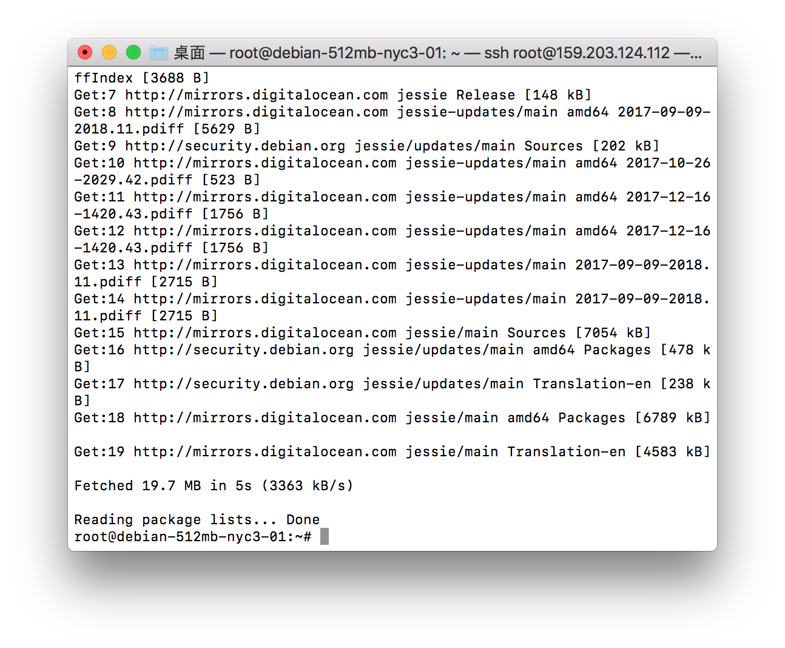
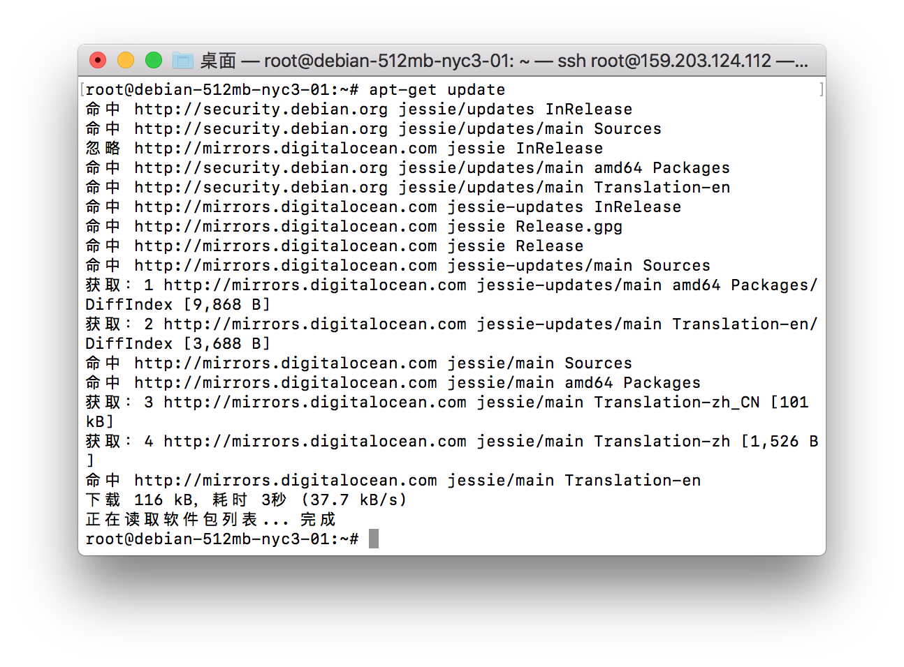

# LocaleCN
更改Linux服务器终端显示语言为中文的脚本

## 使用前

## 使用后

## 命令

    wget -N --no-check-certificate https://raw.githubusercontent.com/FunctionClub/LocaleCN/master/LocaleCN.sh && bash LocaleCN.sh

## 系统支持

* Debian 8 / 9
* Ubuntu 14 / 16
* CentOS 6 / 7

## 反馈

这个脚本在Digital Ocean上面都测试完成了。但是不清楚其他系统是否能测试成功。如果出现无法使用的情况，可以反馈给我。

* 网站：[zhujiboke.com](https://www.zhujiboke.com)
* QQ群：119612388
* Github Issue
* TG群：[https://t.me/functionclub](https://t.me/functionclub)

